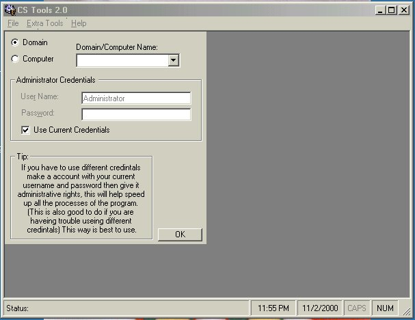



## CS Tools

### Description

You need to have WMI 1.5 and ADSI 2.5 installed by Microsoft. You can get this from my homepage, it is free from Microsoft. CS Tools is a great administrative tool that all Windows NT/2000 administrator should have.

It is a great time saver with many features to make the job of administrating hundreds to thousands of users as easy as 1,2,3.

This program can save you days to weeks of work on a huge domain with hundreds to thousands of users with its "Bulk Administration" and remote feature.

Features

Bulk Administration

Allows you to administer the login path, profile path, home directory,

and more with one click of a button for all users!

Alternate Credentials

Allows you to specify a different username and password to complete your tasks.

This enables you to administer a network without actually having to be logged on.

It also allows you to specify the different username and password over the internet.

Administer Users

Administers any user as if though you were on the server itself.

Even view information that cannot be accessed from windows itself.

Groups

Administer group and group members along with there descriptions

with ease.

Computers

View information on remote computers along with there services, processes and much more.

Remote Command

This function allows you to open any executable file on a remote computer without having to install any software on the remote computer itself.

It is completely clientless!

Services

Allows you to: View, Start, Stop, and pause any service on a local or remote machine.

Processes

Enables you to view and kill processes from a local or remote machine.

Resolve Host to a IP

Resolve any internet address or computer name on your network to its IP address.

Ping

A small ping utilities is also included.

Internet Domain Name Lookup

A little extra, lookup information on a domain with a click of a button.

Example: microsoft.com

Reset Users Password

Reset a users password.

User Migration/Backup

Store allot of information on all or selected users into a database.

With the restore ability you can migration or modify users information to a new or existing server or Domain.
 
### More Info
 

             |
---                |---
**Submitted On**   |2000-09-06 23:17:56
**By**             |[Shane Croft](https://github.com/Planet-Source-Code/PSCIndex/blob/master/ByAuthor/shane-croft.md)
**Level**          |Advanced
**User Rating**    |4.9 (73 globes from 15 users)
**Compatibility**  |VB 6\.0
**Category**       |[Complete Applications](https://github.com/Planet-Source-Code/PSCIndex/blob/master/ByCategory/complete-applications__1-27.md)
**World**          |[Visual Basic](https://github.com/Planet-Source-Code/PSCIndex/blob/master/ByWorld/visual-basic.md)
**Archive File**   |[CODE\_UPLOAD112471122000\.zip](https://github.com/Planet-Source-Code/shane-croft-cs-tools__1-12495/archive/master.zip)

